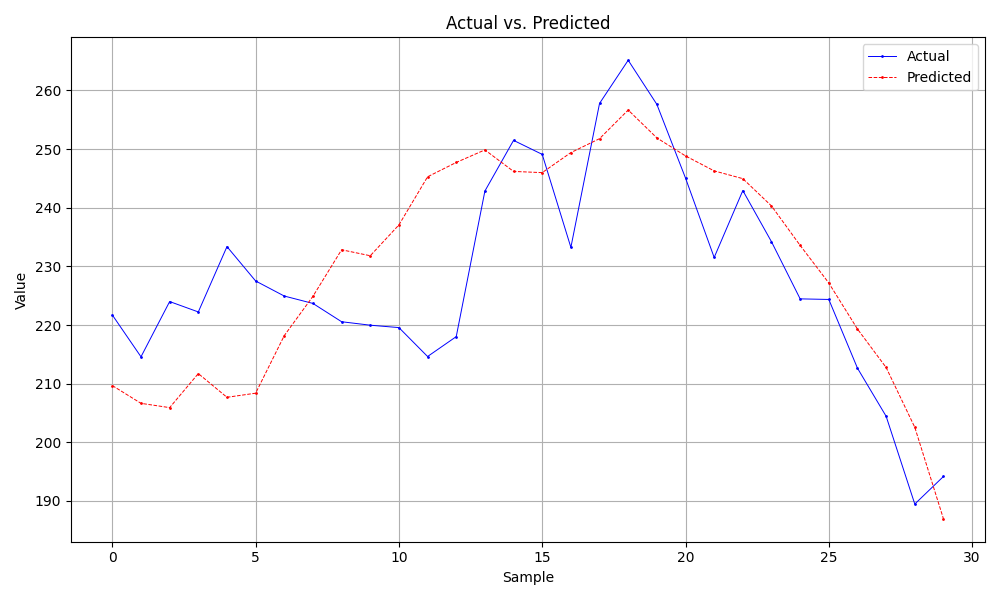

# Stock Price Predictions

## Description
This repository contains code and analysis used for a research paper exploring the use of AI&ML approaches to predicting stock prices. The project is not a live trading bot or any sort of financial tool. It aims to showcase the accuracy and feasibility of AI&ML approaches from a simulation.

## Contents
'comparison/' - Graphs and CSV files used to communicate results in research paper
'data_collection/' - Code files used to make API calls and fetch all the data used for the project
'eda/' - Exploratory Data Analysis graphs used to introduce dataset in research paper
'modeling/' - Code files used to define the neural network and save appropriate resu;ts
'sim_dump_3000/' - Example file containing outputs from the simulation ran with $3000 to invest with into the early 2022 stock market
'trading/' - Code files used to define logic on simulated trading and portfolio inventorying
'trade_script_simulated' - Main code file used to simulate neural network over early 2022 stock market

## Notes
- Please read over "paper.pdf" for in-depth project results and conclusions